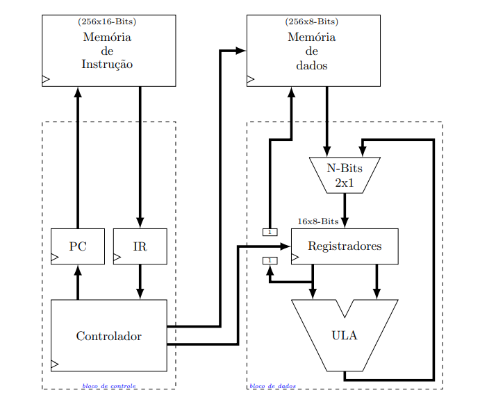
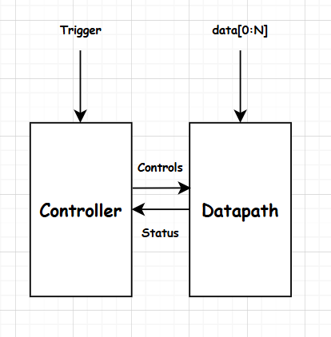
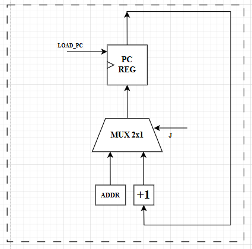
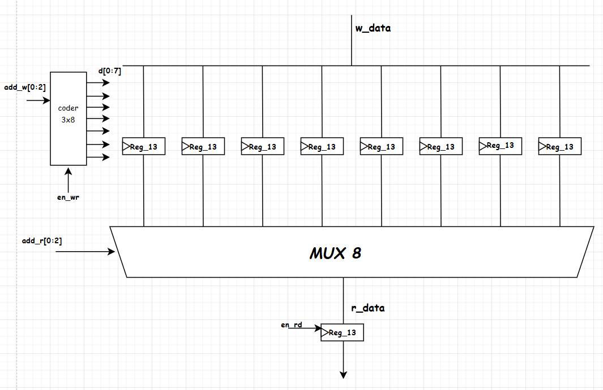
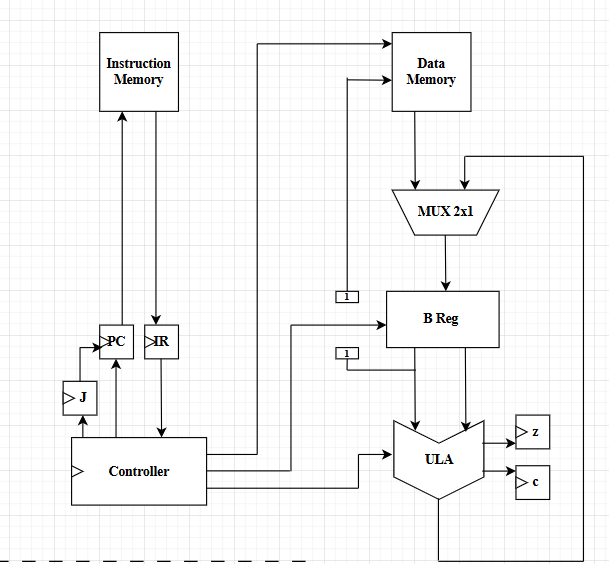
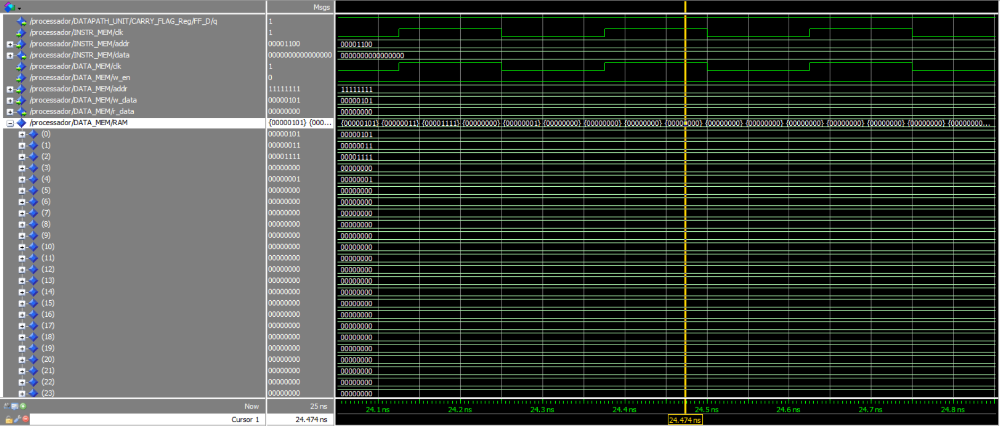

# Projeto: Processador de Uso Geral

**Alunos:**  
Pedro Arthur  
Lucas Matheus  

**Professor:**  
Samaherni Moraes Dias  

---

## Introdução

Esse relatório descreve os procedimentos realizados para a concepção do quinto projeto da disciplina de sistemas digitais, que é um processador de uso geral que trabalha com dados de uma memória RAM de 8 bits, e tem uma memória de até 256 instruções.

A figura abaixo mostra detalhadamente o esquema inicial do projeto proposto:



---

## Referencial Teórico

### Processadores de uso geral

Um processador é um projeto RTL que pode ser programado para fazer determinadas tarefas com os dados de uma memória. Os projetos RTL que foram feitos até agora são processadores de uso específico.

O processador de uso geral é o cérebro dos computadores e celulares atuais, implementado com circuitos digitais de semicondutores.

### Máquina de Estados Finitos

Muitos circuitos podem ser divididos em estados, de acordo com o valor de variáveis em determinados tempos [Tocci]. Essa representação é chamada de **máquina de estados finitos** e é fundamental em sistemas digitais.

### Método de Projeto RTL

O método RTL (Register Transfer Level) permite projetar circuitos a nível de registradores e estados.

#### Controlador

A arquitetura do controlador representa o funcionamento da máquina de estados, com entradas de controle e sinais do datapath.

#### Datapath

O datapath resume-se aos registradores e operações com os dados. No caso de uma pilha (LIFO), o datapath contém:

- Banco de registradores
- Contador de ponteiro
- Somador
- Comparadores



---

## Projeto

### Projeto: Processador de Uso Geral

Este projeto consiste em um processador de uso geral com memória de instruções e de dados.

#### Tabela de Instruções

| Oper. | Classe   | Opcode | 4 bits | 4 bits | 4 bits | Descrição                                 | Carry | ULA |
|-------|----------|--------|--------|--------|--------|-------------------------------------------|--------|------|
| HLT   | Controle | 0000   | -      | -      | -      | PCₖ₊₁ ← PCₖ                                |        |      |
| LDR   | Dados    | 0001   | A      | addrH  | addrL  | Reg[A] ← Memᴰ[addr]                        |        |      |
| STR   | Dados    | 0010   | A      | addrH  | addrL  | Memᴰ[addr] ← Reg[A]                        |        |      |
| MOV   | Dados    | 0011   | -      | B      | C      | Reg[B] ← Reg[C]                            |        |      |
| ADD   | ULA      | 0100   | A      | B      | C      | Reg[A] ← Reg[B] + Reg[C]                   |   ●    |  ●   |
| SUB   | ULA      | 0101   | A      | B      | C      | Reg[A] ← Reg[B] - Reg[C]                   |   ●    |  ●   |
| AND   | ULA      | 0110   | A      | B      | C      | Reg[A] ← Reg[B] AND Reg[C]                 |   ●    |  ●   |
| OR    | ULA      | 0111   | A      | B      | C      | Reg[A] ← Reg[B] OR Reg[C]                  |   ●    |  ●   |
| NOT   | ULA      | 1000   | A      | -      | C      | Reg[A] ← NOT Reg[C]                        |   ●    |  ●   |
| XOR   | ULA      | 1001   | A      | B      | C      | Reg[A] ← Reg[B] XOR Reg[C]                 |   ●    |  ●   |
| CMP   | ULA      | 1010   | A      | B      | C      | Reg[A] ← CMP(Reg[B], Reg[C])              |   ●    |  ●   |
| JMP   | Salto    | 1011   | -      | valH   | valL   | PCₖ₊₁ ← value                              |        |      |
| JNC   | Salto    | 1100   | -      | valH   | valL   | PCₖ₊₁ ← value, se carry = 0               |        |      |
| JC    | Salto    | 1101   | -      | valH   | valL   | PCₖ₊₁ ← value, se carry = 1               |        |      |
| JNZ   | Salto    | 1110   | -      | valH   | valL   | PCₖ₊₁ ← value, se ULA ≠ 0                 |        |      |
| JZ    | Salto    | 1111   | -      | valH   | valL   | PCₖ₊₁ ← value, se ULA = 0                 |        |      |


Nesse projeto será desenvolvido códigos em assembly, por exemplo, para realizar a multiplicação entre dois números inteiros, como também a conversão de binário para inteiro.


##**Multiplicação de dois números inteiros**
A multiplicação de dois números inteiros pode ser realizada facilmente utilizando um laço em python, como segue


```
M = int(input("Digite o valor do primeiro número"))
N = int(input("Digite o valor do segundo número"))


M_times_N = 0

i = 0
while i != N:
  M_times_N = M_times_N + M
  i = i + 1

```


Em assembly a lógica é parecida, porém os laços são feitos utilizando os Jumps condicionais que existem, assim


```
LDR 0 0       ; R0 = M
LDR 1 1       ; R1 = N
LDR 2 6       ; R2 = 0 (resultado)
LDR 3 6       ; R3 = 0 (contador)
LDR 4 4       ; R4 = 1 (constante 1 para incrementar)

loop:
CMP 5 3 1     ; R5 = R3 - R1
JZ fim        ; se contador == multiplicador, fim
ADD 2 2 0     ; R2 += R0
ADD 3 3 4     ; R3 += 1
JMP loop

fim:
STR 2 2       ; salva resultado em Mem[0x02]
HLT
```


Enquanto em linguagem de máquina(binária), o código é dado por


```
0001 0000  0000 0000
0001 0001  0000 0001
0001 0010  0000 0110
0001 0011  0000 0110
0001 0100  0000 0100


1010 0101  0011 0001

1111 0000  0000 1011

0100 0010  0010 0000

0100 0011  0011 0100


1011 0000  0000 0101


0010 0010  0000 0010

0000 0000  0000 0000

```


No código VHDL, A estrutura para essa memória é definida como uma ROM, dada por

```

library ieee;
use ieee.std_logic_1164.all;
use ieee.numeric_std.all;

entity rom256_16b is
    port (
        clk  : in  std_logic;
        addr : in  std_logic_vector(7 downto 0);
        data : out std_logic_vector(15 downto 0)
    );
end entity rom256_16b;

architecture logica of rom256_16b is

    type rom_array is array (0 to 255) of std_logic_vector(15 downto 0);

    constant ROM_CONTENT : rom_array := (
        -- Endereço | Assembly      | Binário (Linguagem de Máquina)
        0          => B"0001000000000000", -- LDR R0, Mem[0] ; R0 = M
        1          => B"0001000100000001", -- LDR R1, Mem[1] ; R1 = N
        2          => B"0001001000000110", -- LDR R2, Mem[6] ; R2 = 0 (resultado)
        3          => B"0001001100000110", -- LDR R3, Mem[6] ; R3 = 0 (contador i)
        4          => B"0001010000000100", -- LDR R4, Mem[4] ; R4 = 1 (constante)
        
        5          => B"1010010100110001", -- loop: CMP R5, R3, R1
        6          => B"1111000000001011", -- JZ fim (salta para endereço 11 se Z=1)
        7          => B"0100001000100000", -- ADD R2, R2, R0 ; resultado += M
        8          => B"0100001100110100", -- ADD R3, R3, R4 ; contador i++
        9          => B"1011000000000101", -- JMP loop (salta para endereço 5)

        10         => B"0010001000000010", -- fim: STR R2, Mem[2] ; Salva resultado
        11         => B"0000000000000000", -- HLT

        others     => B"0000000000000000"
    );

begin
    process(clk)
    begin
        if rising_edge(clk) then
            data <= ROM_CONTENT(to_integer(unsigned(addr)));
        end if;
    end process;
    
end logica;

```


com os dados armazenados em uma ram que permite a escrita:

```
library ieee;
use ieee.std_logic_1164.all;
use ieee.numeric_std.all;

entity rom256_16b is
    port (
        clk  : in  std_logic;
        addr : in  std_logic_vector(7 downto 0);
        data : out std_logic_vector(15 downto 0)
    );
end entity rom256_16b;

architecture logica of rom256_16b is

    type rom_array is array (0 to 255) of std_logic_vector(15 downto 0);

    constant ROM_CONTENT : rom_array := (
        -- Endereço | Assembly      | Binário (Linguagem de Máquina)
        0          => B"0001000000000000", -- LDR R0, Mem[0] ; R0 = M
        1          => B"0001000100000001", -- LDR R1, Mem[1] ; R1 = N
        2          => B"0001001000000110", -- LDR R2, Mem[6] ; R2 = 0 (resultado)
        3          => B"0001001100000110", -- LDR R3, Mem[6] ; R3 = 0 (contador i)
        4          => B"0001010000000100", -- LDR R4, Mem[4] ; R4 = 1 (constante)
        
        5          => B"1010010100110001", -- loop: CMP R5, R3, R1
        6          => B"1111000000001011", -- JZ fim (salta para endereço 11 se Z=1)
        7          => B"0100001000100000", -- ADD R2, R2, R0 ; resultado += M
        8          => B"0100001100110100", -- ADD R3, R3, R4 ; contador i++
        9          => B"1011000000000101", -- JMP loop (salta para endereço 5)

        10         => B"0010001000000010", -- fim: STR R2, Mem[2] ; Salva resultado
        11         => B"0000000000000000", -- HLT

        others     => B"0000000000000000"
    );

begin
    process(clk)
    begin
        if rising_edge(clk) then
            data <= ROM_CONTENT(to_integer(unsigned(addr)));
        end if;
    end process;
    
end logica;

```


##**Conversão binário para decimal ASCII**
A conversão binária para ASCII pode ser feita utilizando subtrações para contar quantas centenas e quantas dezenas, e o resto dessa subtração total são as unidades do número inteiro


```
# Número binário de entrada (0–255)
numero = int(input("Digite um número inteiro entre 0 e 255: "))

# Constantes (como se estivessem em registradores ou memória)
CENTENA = 100
DEZENA = 10
ASCII_ZERO = 48

# Etapa 1: dividir por 100 (centenas)
resto = numero
centenas = 0
while resto >= CENTENA:
    resto -= CENTENA
    centenas += 1

# Etapa 2: dividir o resto por 10 (dezenas)
dezenas = 0
while resto >= DEZENA:
    resto -= DEZENA
    dezenas += 1

# Etapa 3: o que sobrou é unidade
unidades = resto

# Etapa 4: transformar em ASCII
ascii_centena = centenas + ASCII_ZERO
ascii_dezena = dezenas + ASCII_ZERO
ascii_unidade = unidades + ASCII_ZERO

# Resultado final
print(f"ASCII codes: {ascii_centena}, {ascii_dezena}, {ascii_unidade}")
print(f"Caracteres : {chr(ascii_centena)}, {chr(ascii_dezena)}, {chr(ascii_unidade)}")

```


Em assembly a lógica é parecida, porém os laços são feitos utilizando os Jumps condicionais que existem, assim


```
LDR 0 0       ; R0 = M
LDR 1 1       ; R1 = 100( 01100001 )
LDR 2 2       ; R2 = 10 (00001010)
LDR 3 3       ; R3 = 48 (00110000) zero da tabela ASCII
LDR 4 4       ; R4 = 0 (constante 0)
LDR 5 5       ; R5 = 1 (constante de incremento)

MOV 7 4
MOV 8 4

MOV 6 0
loopcentenas:
CMP 10 6 1     ; R6 = R6 - R1
JC fim_loop_centenas   ;
SUB 6 6 1       ;
ADD 7 7 5     ; R7 += 1
JMP loopcentenas


fim_loop_centenas:
ADD 7 7 3
STR 7 6       ; salva resultado em Mem[0x06]


loopdezenas:
CMP 10 6 2     ; R6 = R6 - R2
JC fim_loop_dezenas  
SUB 6 6 2       ;
ADD 8 8 5     ; R8 += 1
JMP loopdezenas


fim_loop_dezenas:
ADD 8 8 3
STR 8 7       ; salva resultado em Mem[0x07]


ADD 6 6 3
STR 6 8 ; Unidade restante, salva resultado em Mem[0x08]
```


Enquanto em linguagem de máquina(binária), o código é dado por


```
0001 0000  0000 0000
0001 0001  0000 0001
0001 0010  0000 0110
0001 0011  0000 0110
0001 0100  0000 0100


0011 0000  0111 0100
0011 0000  1000 0100


```


No código VHDL, A estrutura para essa memória é definida como uma ROM, dada por

```

library ieee;
use ieee.std_logic_1164.all;
use ieee.numeric_std.all;

entity rom256_16b is
    port (
        clk  : in  std_logic;
        addr : in  std_logic_vector(7 downto 0);
        data : out std_logic_vector(15 downto 0)
    );
end entity rom256_16b;

architecture logica of rom256_16b is

    type rom_array is array (0 to 255) of std_logic_vector(15 downto 0);

    -- Programa de Conversão Binário -> ASCII
    constant ROM_CONTENT : rom_array := (
        0  => B"0001000000000000", -- LDR R0, Mem[0]
        1  => B"0001000100000001", -- LDR R1, Mem[1]
        2  => B"0001001000000010", -- LDR R2, Mem[2]
        3  => B"0001001100000011", -- LDR R3, Mem[3]
        4  => B"0001010000000100", -- LDR R4, Mem[4]
        5  => B"0001010100000101", -- LDR R5, Mem[5]
        6  => B"0011011101000000", -- MOV R7, R4
        7  => B"0011100001000000", -- MOV R8, R4
        8  => B"0011011000000000", -- MOV R6, R0
        9  => B"1010000001100001", -- loop_c: CMP R6, R1
        10 => B"1100000000010000", -- JC fim_c (para 19)
        11 => B"0101011001100001", -- SUB R6, R6, R1
        12 => B"0100011101110101", -- ADD R7, R7, R5
        13 => B"1011000000001001", -- JMP loop_c (para 9)
        14 => B"1010000001100010", -- loop_d: CMP R6, R2
        15 => B"1100000000010101", -- JC fim_d (para 21)
        16 => B"0101011001100010", -- SUB R6, R6, R2
        17 => B"0100100010000101", -- ADD R8, R8, R5
        18 => B"1011000000001110", -- JMP loop_d (para 14)
        19 => B"0100011101110011", -- fim_c: ADD R7, R7, R3
        20 => B"0010011100000110", -- STR R7, Mem[6]
        21 => B"0100100010000011", -- fim_d: ADD R8, R8, R3
        22 => B"0010100000000111", -- STR R8, Mem[7]
        23 => B"0100011001100011", -- ADD R6, R6, R3
        24 => B"0010011000001000", -- STR R6, Mem[8]
        25 => B"0000000000000000", -- HLT
        others => B"0000000000000000"
    );

begin
    process(clk)
    begin
        if rising_edge(clk) then
            data <= ROM_CONTENT(to_integer(unsigned(addr)));
        end if;
    end process;
    
end logica;

```


com os dados armazenados em uma ram que permite a escrita:

```
library ieee;
use ieee.std_logic_1164.all;
use ieee.numeric_std.all;

entity ram256_8b is
    port (
        clk    : in  std_logic;
        w_en   : in  std_logic;
        addr   : in  std_logic_vector(7 downto 0);
        w_data : in  std_logic_vector(7 downto 0);
        r_data : out std_logic_vector(7 downto 0)
    );
end entity ram256_8b;

architecture ckt of ram256_8b is

    type memoria_ram is array (0 to 255) of std_logic_vector (7 downto 0);

    -- RAM inicializada para o programa de conversão ASCII com valores em binário
    signal RAM : memoria_ram := (
        0      => B"01111011", -- Número a ser convertido: 123
        1      => B"01100100", -- Constante 100
        2      => B"00001010", -- Constante 10
        3      => B"00110000", -- Constante 48 (offset ASCII '0')
        4      => B"00000000", -- Constante 0
        5      => B"00000001", -- Constante 1
        others => B"00000000"
    );
    
begin

    process (clk)
    begin
        if rising_edge(clk) then
            if w_en = '1' then
                RAM(to_integer(unsigned(addr))) <= w_data;
            end if;
        end if;
    end process;
    
    r_data <= RAM(to_integer(unsigned(addr)));

end ckt;

```


## Projetando os Blocos do Circuito

O processador é um sistema digital complexo que pode ser dividido em vários componentes. A seguir, descrevemos os principais blocos do **datapath**, responsável pelas operações com os dados.

### Contador de Programa

Para controlar a execução sequencial das instruções ou saltos, o contador de programa usa um registrador, um somador e um multiplexador para decidir se incrementa o PC ou realiza um salto.



---

### ULA

A Unidade Lógica e Aritmética (ULA) é um dos principais componentes do processador, sendo responsável pelas operações lógicas e aritméticas com os dados dos registradores.

Ela possui resolução de 8 bits e 8 canais de operação, selecionados por uma chave controlada pela máquina de estados.

---

### Registradores de Flags

A instrução `CMP` do processador exige o uso de **registradores de flag** para armazenar os bits de **carry** e **zero**, utilizados nas instruções de salto condicional (`JC`, `JNC`, `JZ`, `JNZ`).

---

### Banco de Registradores

Esse componente atua como a memória local do processador. Ele armazena os dados de entrada (`w_data`) ou fornece dados de leitura (`r_data`).

A estrutura é formada por múltiplos registradores organizados em paralelo e multiplexadores para seleção de entrada e saída.



---

### Memória de Dados (RAM)

A RAM utilizada possui:

- Escrita síncrona (com clock)
- Leitura assíncrona
- Controle via vetor no VHDL

A implementação base foi fornecida pelo professor.

---

### Memória de Instrução (ROM)

A ROM possui saída assíncrona e também é controlada por vetor em VHDL, conforme modelo disponibilizado pelo professor.

---

### Processador

A organização geral do processador segue o modelo RTL, com muitos componentes do datapath distribuídos e interconectados.



---

### Máquina de Estados (Controlador)

A figura abaixo representa o diagrama de estados do controlador do processador.


No estado inicial (reset), todos os valores estão zerados. A transição para o estado `W` ocorre com o sinal de **clear** em nível lógico alto.

A partir de `W`, são possíveis dois estados:

- `Push`: realiza escrita na pilha
- `Pop`: realiza leitura

As operações são acionadas a cada pulso de clock.

---

## Implementação

### Diagrama de Blocos

A estrutura completa do projeto RTL pode ser visualizada no seguinte diagrama:


---

### Código VHDL

A implementação foi feita utilizando os componentes descritos anteriormente com o método de projeto RTL. Os arquivos estão disponíveis no repositório abaixo:

🔗 [Repositório no GitHub](https://github.com/PedroDS4/Projeto_Processador)

---

### Implementação no Kit da DE2

Utilizando o **Quartus II**, o código VHDL foi compilado e carregado no kit DE2.

- **Verificação de Sintaxe**: realizada com sucesso
- **Mapeamento de Pinos**:
  - Entradas de dados: `SW[12:0]`
  - Botões de controle: `KEY[1]` (leitura), `KEY[2]` (escrita), `KEY[3]` (clear)
  - Saídas para LEDS e HEX displays

Referência ao manual da DE2 foi essencial para o mapeamento correto [manual_DE2].

---

## Resultados

### Simulação no ModelSim

Foi realizada uma simulação no ModelSim com clock de `4 GHz`. O processador executou corretamente o código Assembly de **multiplicação de dois inteiros**.

O resultado final foi armazenado no endereço `[3]` da RAM.



---

### Implementação no Kit da DE2

No kit físico, a verificação de sintaxe e compilação foram realizadas com sucesso. O carregamento da ROM com o código de multiplicação confirmou a execução correta do programa Assembly.

---

## Conclusão

O projeto final da disciplina de **Sistemas Digitais** foi concluído com êxito. O processador de uso geral foi implementado com base no método RTL, incluindo:

- Máquina de estados para controle
- ULA desenvolvida anteriormente
- Memórias ROM/RAM
- Banco de registradores e registradores de flags

A simulação em **ModelSim** e a validação no **kit DE2** comprovaram o correto funcionamento do sistema.

---


---

